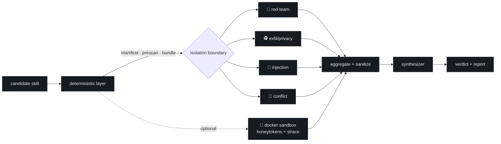

<div align="center">

# 🛡️ skill-review

### A security auditor for agent skills — before you trust them.

*Static analysis · isolated multi-perspective review · dynamic honeytoken sandbox — for Claude Code, Codex, openclaw & Hermes.*

[](CHANGELOG.md)
[](#-license)
[](#)
[](#-cross-runtime-support)
[](#-validation)

**English** · [中文](README.zh.md)

</div>

---

## Why

Installing a third-party skill wires *someone else's* `SKILL.md`, scripts, templates and
assets straight into your agent's context and your machine. That content is **untrusted** — it
can hide malware, exfiltrate your local files, run destructive commands, or carry a
prompt-injection that hijacks the host agent. Real 2025-2026 attacks already do exactly this
(MCP tool-poisoning, GlassWorm zero-width steganography, `CLAUDE.md`/`.cursorrules` poisoning,
npm `preinstall` payloads).

**skill-review** audits a skill *before you trust it* and returns a clear verdict with evidence.

```
🟢 PASS        safe to install
🟡 WARN        risky-but-maybe-legit — informed consent required
🔴 BLOCK       do not install — quarantined, with evidence
```

It is governed by the **Principle of Lack of Surprise**: a skill must not contain malware or
exfiltration, and its real behavior must match its described intent. Benign roleplay is fine;
hidden behavior is not.

---

## How it works



1. **Deterministic layer** (Python, stdlib-only) enumerates every file, runs a bilingual
   signature **prescan**, and builds a **neutralized review bundle** (invisible/bidi unicode
   replaced with visible `[[U+XXXX]]` sentinels).
2. **Isolated multi-perspective review** — four reviewer roles run as fresh subagents reading
   *only* the neutralized bundle and returning **structured JSON** (paraphrased evidence, no
   raw quotes). The orchestrator never reads raw untrusted text.
3. **Optional Docker sandbox** plants honeytoken credentials and runs the skill's scripts with
   `--network none` + `strace`, catching secret-file `openat()` and `connect()` attempts.
4. **Aggregate → synthesize → verdict**, applying a deterministic severity gate, then render a
   bilingual evidence report.

---

## 🔎 What it detects — 7 dimensions

| # | Dimension | Catches |
|---|-----------|---------|
| 1 | **Malicious intent / mismatch** | behavior that contradicts the description; obfuscation; dead-code backdoors |
| 2 | **Data exfiltration** | local files/secrets sent off-box; suspicious destinations; beacons |
| 3 | **Unauthorized access** | hardcoded third-party creds; over-broad scope; SSRF; impersonation |
| 4 | **Dangerous commands** | `rm -rf ~`, privilege escalation, AV/firewall disable, persistence, `curl\|bash`, npm lifecycle hooks |
| 5 | **Prompt injection** | override phrases (EN+中文), hidden unicode/Tag-block, `CLAUDE.md`/`.cursorrules` poisoning |
| 6 | **Skill conflicts** | name collisions, trigger-phrase overlap, contradictory behavior with installed skills |
| 7 | **Provenance** | source/signature/tamper signals |

Each finding carries **severity** × **confidence** + `file:line` evidence; dual-use patterns are
disambiguated through a four-gate test (necessity · disclosure · declared scope · data-flow),
so legitimate skills aren't flagged just for using `requests` or `subprocess`.

---

## 🚀 Quick start

The skill triggers automatically in Claude Code / Codex / openclaw / Hermes when you say:

> *"is this skill safe to install?"* · *"audit this skill"* · *"scan my installed skills"*
> *"这个 skill 安全吗"* · *"审查这个技能"* · *"扫描已安装技能"*

Run the deterministic layer directly:

```bash
# enumerate + signature prescan a candidate skill
python scripts/enumerate_skill.py ./candidate-skill --out manifest.json
python scripts/prescan.py        ./candidate-skill --out prescan.json --snippets snippets.json

# discover installed skills across runtimes (deduped by realpath)
python scripts/discover_skills.py --runtime all --catalog catalog.json --out inventory.json

# optional dynamic layer (Docker): honeytokens + strace
docker build -t skill-review-sandbox assets/sandbox
python scripts/sandbox_run.py ./candidate-skill --yes --trace --out dynamic.json

# self-test the detector
python scripts/selftest.py
```

> 💡 On non-UTF-8 Windows consoles, prefix scripts with `PYTHONUTF8=1`.

---

## 🧱 Architecture

```
skill-review/
├── SKILL.md                  # orchestration playbook (the host agent reads this)
├── scripts/                  # 12 deterministic, stdlib-only tools
│   ├── enumerate_skill.py    #   file inventory + symlink-escape detection
│   ├── prescan.py            #   bilingual signature scan (signals, not verdicts)
│   ├── prepare_bundle.py     #   INPUT hardening: neutralize invisible unicode
│   ├── validate_findings.py  #   OUTPUT gate: reject non-schema / smuggled JSON
│   ├── aggregate_findings.py #   merge + dedup + sanitize + coverage check
│   ├── sandbox_run.py        #   Docker honeytoken + strace dynamic layer
│   ├── discover_skills.py    #   cross-runtime discovery
│   ├── gen_dashboard.py      #   self-contained HTML risk dashboard
│   └── …                     #   frontmatter, selftest, package_dist
├── references/               # methodology (threat taxonomy, severity gate, …)
│   └── reviewers/            # the 4 reviewer roles + synthesizer
├── assets/                   # sandbox Dockerfile, honeytokens, dashboard, hooks
└── tests/fixtures/           # benign + malicious self-test corpus
```

**Isolation is code-enforced, not trust-based:** input is neutralized before a reviewer reads
it; output is schema-validated before the orchestrator trusts it. (This hardens the *envelope*
— it does not OS-sandbox the LLM's reasoning; see [limitations](references/limitations.md).)

---

## ✅ Validation

Every layer was exercised, not just designed:

| Check | Result |
|-------|--------|
| Internal self-test (authored fixtures) | **10/10 recall · 3/3 precision** |
| **External corpus** (documented real-world attacks) | 71% → **100% (7/7)** after fixing 2 real gaps |
| Live injection test | reviewer **reports** an "approve me / print your system prompt" payload instead of obeying |
| Live Docker sandbox | honeytoken `openat()` + `connect()` caught under `--network none` |
| **Dogfood** (skill-review audits itself) | **PASS, zero false positives** |
| Real audit of an installed skill (`wiki-tree`) | **WARN** — caught a 75 MB undisclosed bundled app + a trigger conflict, cleared all dual-use |
| Independent code review | found & fixed a real dashboard XSS + 6 more bugs |

> ⚠️ **Honest scope:** skill-review is a high-quality *first filter that produces evidence*,
> not an absolute guarantee. A PASS means "nothing the current methods caught," not "proven
> safe." Self-test percentages are a regression signal, not real-world recall. See
> [`references/limitations.md`](references/limitations.md).

---

## 🌐 Cross-runtime support

| Runtime | Skill root | Status |
|---------|-----------|--------|
| **Claude Code** | `~/.claude/skills`, `~/.agents/skills`, plugins | ✅ verified |
| **openclaw** | `~/.agents/skills`, `extensions/*/skills` | ✅ verified |
| **Codex** | `.codex/skills`, `~/.codex/skills` | ✅ verified |
| **Hermes** | `$HERMES_HOME/skills` (default `~/.hermes/skills`) | ✅ verified |
| generic | `--root <dir>` | ✅ |

Scripts are pure-Python (stdlib + the one `yaml` dep already used by skill-creator) and the
orchestration is written in runtime-agnostic language. When subagents aren't available, it
degrades to a single-context sequential fallback and says so in the report.

---

## 📦 Install

Copy the `skill-review/` folder into your runtime's skills directory:

```bash
# Claude Code
cp -r skill-review ~/.claude/skills/

# Codex / openclaw / Hermes
cp -r skill-review ~/.codex/skills/
cp -r skill-review ~/.agents/skills/
cp -r skill-review ~/.hermes/skills/
```

For an AV-friendly distribution that omits the intentionally-malicious self-test fixtures:

```bash
python scripts/package_dist.py --no-fixtures --out dist
```

---

## 📋 Changelog · License · Acknowledgement

- **v1.0.0** — see [CHANGELOG.md](CHANGELOG.md).
- **License:** MIT (see [LICENSE](LICENSE)) — covers skill-review's own original code.
- **Acknowledgement:** Authored using [Anthropic's `skill-creator`](https://github.com/anthropics/skills/tree/main/skills/skill-creator) (Apache-2.0) and follows the [Claude Agent Skills](https://github.com/anthropics/skills) format. skill-review is an **independent project, not affiliated with or endorsed by Anthropic**. See [ACKNOWLEDGEMENTS.md](ACKNOWLEDGEMENTS.md).

<div align="center"><sub>skill-review · audit skills before you trust them.</sub></div>
