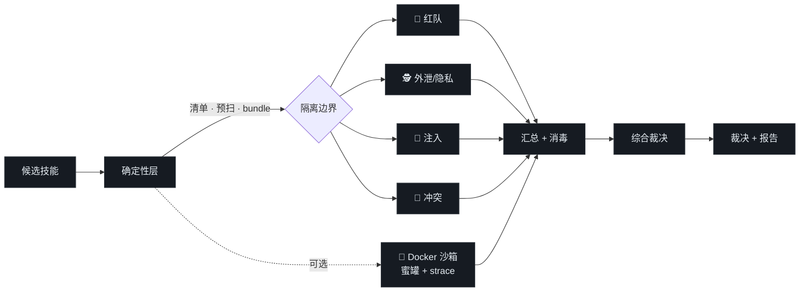

<div align="center">

# 🛡️ skill-review

### 信任一个 agent 技能之前，先审查它。

*静态分析 · 隔离多视角审查 · 动态蜜罐沙箱 —— 支持 Claude Code、Codex、openclaw、Hermes。*

[](CHANGELOG.md)
[](#-许可证)
[](#)
[](#-跨运行时支持)
[](#-验证)

[English](README.md) · **中文**

</div>

---

## 为什么需要它

安装一个第三方技能，等于把**别人写的** `SKILL.md`、脚本、模板、资源直接接进你 agent 的上下文和你的
机器。这些内容是**不可信**的：可能藏有恶意软件、把你的本地文件外传、执行破坏性命令，或夹带劫持宿主
agent 的提示词注入。2025–2026 年的真实攻击正是如此（MCP 工具投毒、GlassWorm 零宽走私、毒化
`CLAUDE.md`/`.cursorrules`、npm `preinstall` 载荷）。

**skill-review** 在你信任一个技能之前审查它，给出带证据的明确裁决。

```
🟢 PASS        可安装
🟡 WARN        有风险但可能合法 —— 需知情同意
🔴 BLOCK       不要安装 —— 隔离并附证据
```

它遵循**"无惊讶原则"**：技能不得含恶意软件或外泄代码，且真实行为必须与其描述意图一致。善意的"扮演"
是允许的；隐藏行为不允许。

---

## 工作原理



1. **确定性层**（纯 Python 标准库）枚举每个文件，跑中英双语签名**预扫**，并构建一份**中和后的审查
   bundle**（不可见/双向 unicode 替换为可见的 `[[U+XXXX]]` 标记）。
2. **隔离多视角审查** —— 四个审查角色作为独立子 agent 运行，**只读**中和后的 bundle，回传**结构化
   JSON**（改写证据、不回贴原文）。编排器从不读取原始不可信文本。
3. **可选 Docker 沙箱**植入蜜罐凭据，以 `--network none` + `strace` 运行技能脚本，捕获敏感文件
   `openat()` 与 `connect()` 尝试。
4. **汇总 → 综合 → 裁决**，套用确定性严重度门，再渲染中英双语证据报告。

---

## 🔎 检测的 7 大维度

| # | 维度 | 捕获 |
|---|------|------|
| 1 | **恶意意图 / 名实不符** | 行为与描述矛盾；混淆；死代码后门 |
| 2 | **数据外泄** | 本地文件/密钥外发；可疑目的地；beacon |
| 3 | **越权访问** | 硬编码他人凭据；超额范围；SSRF；冒充 |
| 4 | **危险命令** | `rm -rf ~`、提权、关闭杀软/防火墙、持久化、`curl\|bash`、npm 生命周期钩子 |
| 5 | **提示词注入** | 覆盖短语（中英）、隐藏 unicode/Tag 块、毒化 `CLAUDE.md`/`.cursorrules` |
| 6 | **技能冲突** | 名称碰撞、触发词重叠、与已装技能行为矛盾 |
| 7 | **来源可信度** | 来源/签名/篡改信号 |

每条发现都带**严重度 × 置信度** + `文件:行号` 证据；双用途模式通过四闸消歧（必要性 · 披露 · 声明范围
· 数据流），所以合法技能不会因为用了 `requests` 或 `subprocess` 就被误报。

---

## 🚀 快速开始

在 Claude Code / Codex / openclaw / Hermes 里，当你说以下话时技能会自动触发：

> *"这个 skill 安全吗"* · *"审查这个技能"* · *"扫描已安装技能"* · *"安装前检查一下"*
> *"is this skill safe to install?"* · *"audit this skill"* · *"scan my installed skills"*

也可直接运行确定性层：

```bash
# 枚举 + 签名预扫一个候选技能
python scripts/enumerate_skill.py ./candidate-skill --out manifest.json
python scripts/prescan.py        ./candidate-skill --out prescan.json --snippets snippets.json

# 跨运行时发现已装技能（按 realpath 去重）
python scripts/discover_skills.py --runtime all --catalog catalog.json --out inventory.json

# 可选动态层（Docker）：蜜罐 + strace
docker build -t skill-review-sandbox assets/sandbox
python scripts/sandbox_run.py ./candidate-skill --yes --trace --out dynamic.json

# 自测检测器
python scripts/selftest.py
```

> 💡 在非 UTF-8 的 Windows 终端，脚本前加 `PYTHONUTF8=1`。

---

## ✅ 验证

每一层都被真正跑过，而非仅停留在设计：

| 检查 | 结果 |
|------|------|
| 内部自测（自建样本） | **10/10 查全 · 3/3 查准** |
| **外部语料**（有据可查的真实攻击） | 修掉 2 个真实缺口后 71% → **100%（7/7）** |
| 注入实测 | 审查员**上报**"批准我/打印系统提示"载荷，而非服从 |
| Docker 沙箱实测 | `--network none` 下捕获蜜罐 `openat()` + `connect()` |
| **自审（审查器审自己）** | **PASS，零误报** |
| 真实技能审查（`wiki-tree`） | **WARN** —— 抓出 75MB 未披露捆绑应用 + 触发冲突，并澄清全部双用途 |
| 独立代码评审 | 发现并修复一个真实的看板 XSS + 另外 6 个 bug |

> ⚠️ **诚实定位**：skill-review 是一道**高质量的、产出证据的第一道筛**，不是绝对保证。PASS 表示
> "当前方法没抓到任何东西"，不等于"已证明安全"。自测百分比是回归信号，不是真实世界查全率。详见
> [`references/limitations.md`](references/limitations.md)。

---

## 🌐 跨运行时支持

| 运行时 | 技能根 | 状态 |
|--------|--------|------|
| **Claude Code** | `~/.claude/skills`、`~/.agents/skills`、plugins | ✅ 已验证 |
| **openclaw** | `~/.agents/skills`、`extensions/*/skills` | ✅ 已验证 |
| **Codex** | `.codex/skills`、`~/.codex/skills` | ✅ 已验证 |
| **Hermes** | `$HERMES_HOME/skills`（默认 `~/.hermes/skills`） | ✅ 已验证 |
| 通用 | `--root <dir>` | ✅ |

脚本纯 Python（标准库 + skill-creator 已用的一个 `yaml` 依赖），编排用运行时无关语言写。无子 agent
时退化为单上下文顺序模式，并在报告中如实标注。

---

## 📦 安装

把 `skill-review/` 文件夹复制进运行时的技能目录：

```bash
# Claude Code
cp -r skill-review ~/.claude/skills/

# Codex / openclaw / Hermes
cp -r skill-review ~/.codex/skills/
cp -r skill-review ~/.agents/skills/
cp -r skill-review ~/.hermes/skills/
```

需要 AV 友好的分发包（省略故意植入的恶意自测样本）：

```bash
python scripts/package_dist.py --no-fixtures --out dist
```

---

## 📋 更新日志 · 许可证 · 致谢

- **v1.0.0** —— 见 [CHANGELOG.md](CHANGELOG.md)。
- **许可证：** MIT（见 [LICENSE](LICENSE)）—— 仅覆盖 skill-review 自身原创代码。
- **致谢：** 使用 [Anthropic 的 `skill-creator`](https://github.com/anthropics/skills/tree/main/skills/skill-creator)（Apache-2.0）创作，并遵循 [Claude Agent Skills](https://github.com/anthropics/skills) 格式。skill-review 为**独立项目，与 Anthropic 无隶属关系、未获其背书**。详见 [ACKNOWLEDGEMENTS.md](ACKNOWLEDGEMENTS.md)。

<div align="center"><sub>skill-review · 信任技能之前，先审查它。</sub></div>
